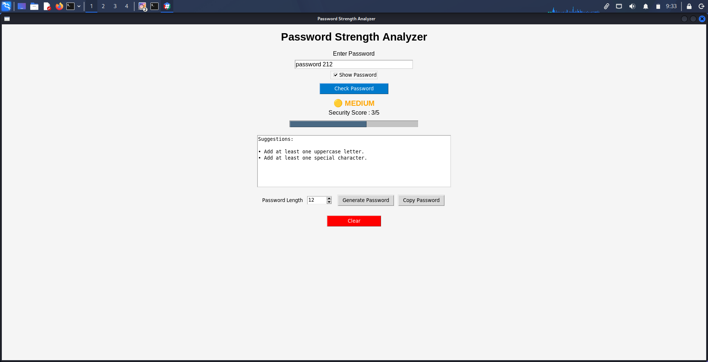

# 🔐 Password Strength Analyzer

A Python GUI application that analyzes password strength and provides security recommendations.

## 🚀 Features

- Check password strength
- Detect weak passwords
- Suggest stronger passwords
- User-friendly GUI
- Built using Python and Tkinter

## 🛠 Technologies Used

- Python 3
- Tkinter
- Regular Expressions (re)

## 📷 Screenshot



## ▶️ How to Run

```bash
python3 password_strength_gui.py
```

## 📂 Project Structure

```
PasswordStrengthAnalyzer/
│── password_strength.py
│── password_strength_gui.py
│── README.md
└── assets/
    └── Screenshot_2026-07-08_09_33_44.png
```

## 👨‍💻 Author

**Gagandeep H N**
